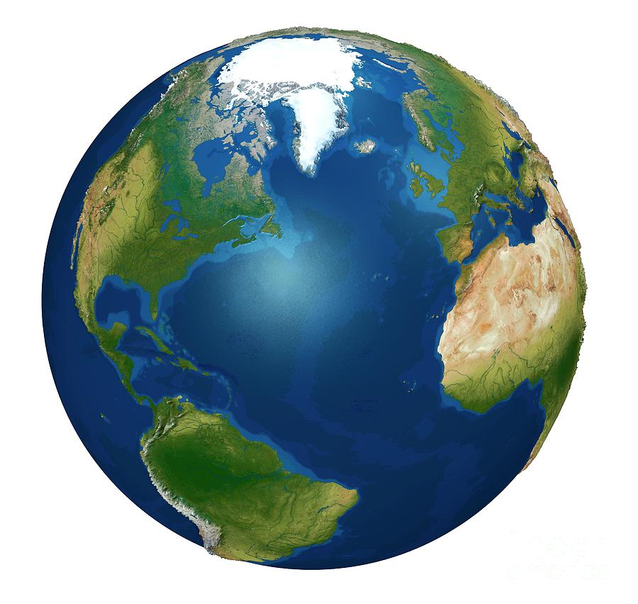

# ONEWORLD 🌍

ONEWORLD is a web project dedicated to promoting global cultural awareness, connection, and understanding. Explore stories, meet people from diverse backgrounds, and learn about cultures and travel statistics from around the world.

## Features
- **Responsive Design**: Clean layout, dark mode, and mobile-friendly.
- **Navigation Bar**: Easy access to all sections.
- **Stories & People**: Discover stories and profiles from different cultures.
- **Petition**: Sign and support global cultural awareness initiatives.
- **Contact Form**: Get in touch for more information or collaboration.

## Demo


## Getting Started

1. **Clone the repository:**
   ```bash
   git clone https://github.com/ChikwandaChisha/ONEWORLD.git
   cd ONEWORLD
   ```
2. **Open `index.html` in your browser.**

## Project Structure
```
├── images/           # Project images and icons
├── index.html        # Main HTML file
├── styles.css        # CSS styles
├── script.js         # JavaScript for interactivity
└── README.md         # Project documentation
```

## Contributing
We welcome contributions! Please fork the repo and submit a pull request.

## License
This project is for educational and advocacy purposes.

## Author
Chikwanda Chisha

